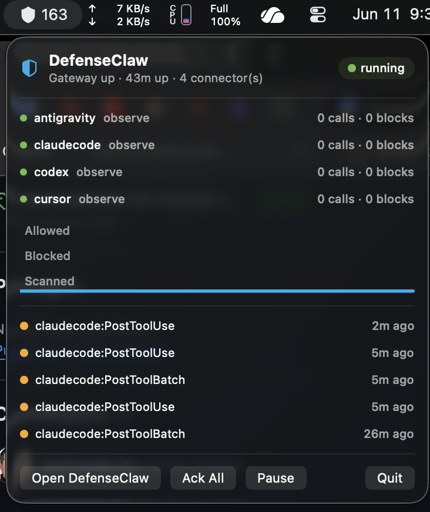
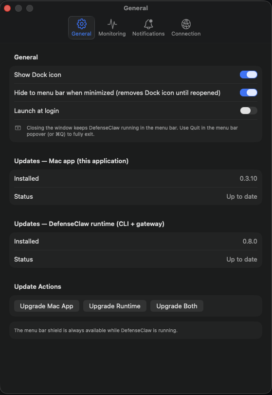

# DefenseClaw for macOS

Native menu-bar companion app for [cisco-ai-defense/defenseclaw](https://github.com/cisco-ai-defense/defenseclaw), replicating the `defenseclaw tui` terminal dashboard with SwiftUI and Swift Charts. See [SPECIFICATION.md](SPECIFICATION.md) for the full application spec.


The app lives in the menu bar: the shield icon shows live gateway/alert state, and the popover gives an at-a-glance summary with recent findings — even while the main window is closed or minimized.

<p align="center">
  
</p>

The General settings view shows app visibility controls plus independent update status and actions for the Mac app and the DefenseClaw runtime.

<p align="center">
  
</p>

## Install

Grab the latest prebuilt app from [Releases](https://github.com/keitheobrien/defenseclaw_mac/releases) (arm64, macOS 14+). Release builds are signed with Developer ID, use hardened runtime, and are notarized by Apple with a stapled ticket. Unzip the archive, move `DefenseClawMac.app` to `/Applications`, then open it normally. If you previously installed an ad-hoc build, delete the old `/Applications/DefenseClawMac.app` before copying in the notarized release.

## Build & run

Build from source — no prebuilt binary ships in the git tree itself (`build/` is gitignored):

- Open `DefenseClawMac.xcodeproj` in Xcode (16+) and Run, **or** from the command line:
  ```
  xcodebuild -project DefenseClawMac.xcodeproj -scheme DefenseClawMac -configuration Release build
  ```
  then copy the app out of derived data:
  ```
  open "$(xcodebuild -project DefenseClawMac.xcodeproj -scheme DefenseClawMac -configuration Release -showBuildSettings | awk '/BUILT_PRODUCTS_DIR/{print $3; exit}')/DefenseClawMac.app"
  ```
- Requires macOS 14+ and Xcode 16+. No external dependencies (SQLite via the SDK's `SQLite3` module; YAML via a built-in minimal parser). Local source builds are for development; distribution releases are built separately with Developer ID signing and Apple notarization.

## What it connects to

A local DefenseClaw installation (companion app — it does not manage the backend):

| Source | Path / address |
|---|---|
| Go gateway REST API | `http://127.0.0.1:<gateway.api_port>` (default 18970) |
| Audit DB (read-only) | `~/.defenseclaw/audit.db` |
| Event stream (tail) | `~/.defenseclaw/gateway.jsonl` |
| Config | `~/.defenseclaw/config.yaml` + `~/.defenseclaw/.env` |

**Token resolution** matches the Python CLI's ladder (`config.py::resolved_token`): env var named by `gateway.token_env` → `DEFENSECLAW_GATEWAY_TOKEN` → `OPENCLAW_GATEWAY_TOKEN` → literal `gateway.token`, with `~/.defenseclaw/.env` consulted because GUI apps inherit no shell environment.

## Panels

Sidebar groups mirror the TUI's 13 panels: **Monitor** (Overview, Alerts, Logs, Audit, Activity), **Govern** (Skills, MCPs, Plugins, Tools), **Discover** (Inventory, AI Discovery, Registries), **Configure** (Setup with all 7 wizards + config editor). ⌘1–⌘9, ⌘0, and ⌘⇧1–⌘⇧3 jump between panels; ⌘R refreshes; ⌘F searches.

The menu bar shield reflects live state (healthy / alert count / degraded / offline / scanning / paused) on a 5-second pulse, with native notifications for new CRITICAL/HIGH findings. Settings ▸ General controls Dock-icon visibility and hide-on-close (pure menu-bar-agent mode).

## Verified TUI parity

Validated side-by-side against `defenseclaw tui` 0.7.0 on a live install (2026-06-10): Overview tiles (Hook Calls / Blocks / Findings / Guardrail), alert counts, and the alert queue match the TUI's exact semantics — Hook Calls and Blocks count within the last 500 audit events (`list_events(500)`), Findings = CRITICAL+HIGH across the audit alert queue (`list_alerts(500)` severity buckets) plus scan blocks grouped by `scan_id` from the full `gateway.jsonl`, and Acknowledge/Dismiss shell to `defenseclaw alerts acknowledge|dismiss --severity …` (severity → ACK in the DB), exactly as the TUI does.

## Known notes

- `GET /skills` and `GET /tools/catalog` return **HTTP 502** when no OpenClaw agent is running behind the gateway (hook-based connectors like claudecode/codex/cursor don't serve these catalogs). The app surfaces this as an explanatory banner — it is the gateway's true answer, not an app error.
- If you run a window manager with ⌘-number shortcuts (e.g. Magnet), those keys may never reach the app; use the sidebar or the Go menu instead.
- Setup wizard "Apply" and Registry "Sync" shell out to the `defenseclaw` CLI (path override in Settings ▸ Connection).
