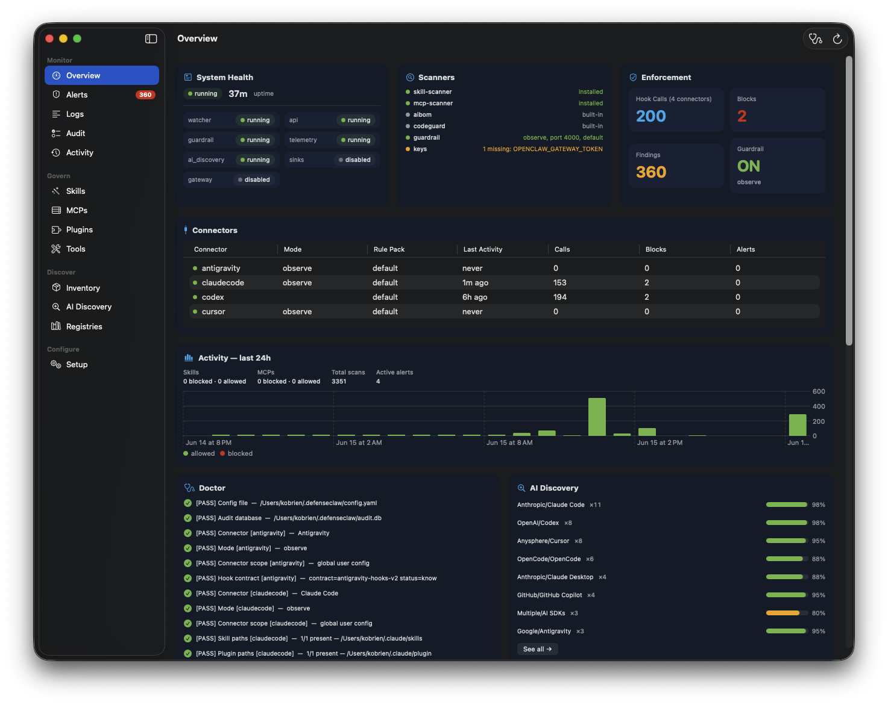
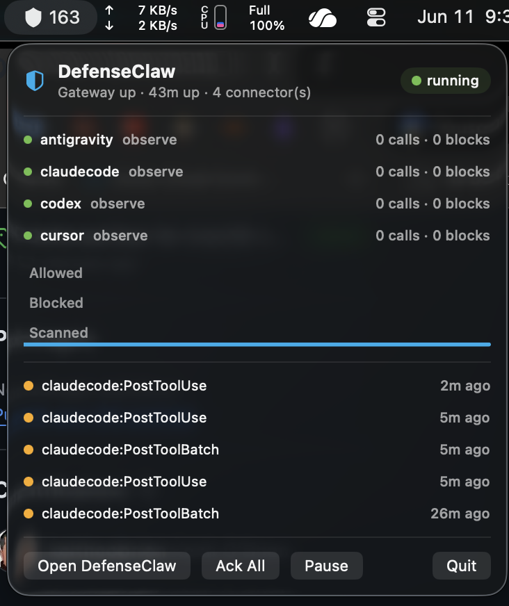
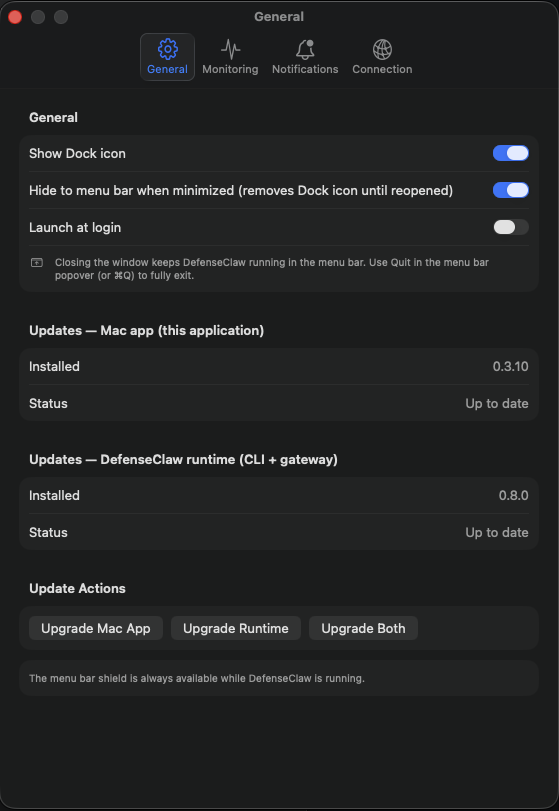

# DefenseClaw for macOS

Native macOS companion for [cisco-ai-defense/defenseclaw](https://github.com/cisco-ai-defense/defenseclaw), with a menu-bar dashboard, runtime monitoring, configuration, and gateway controls built with SwiftUI and Swift Charts.



The app lives in the menu bar: the shield icon shows live gateway/alert state, and the popover gives an at-a-glance summary with recent findings — even while the main window is closed or minimized.

<p align="center">
  
</p>

The General settings view shows app visibility controls plus independent update status and actions for the Mac app and the DefenseClaw runtime.

<p align="center">
  
</p>

## Install

Requires **Apple silicon (arm64) and macOS 14 or later**. Both downloads are signed with Developer ID, use the hardened runtime, and are notarized by Apple with stapled tickets.

| Package | Use when |
| --- | --- |
| **App-only ZIP** | DefenseClaw is already installed or managed separately. This is also the built-in app updater's download. |
| **Unified installer DMG** | Setting up a new Mac. Includes an authenticated DefenseClaw runtime payload for a fresh installation. |

1. Open the DMG or unzip the app, then move **DefenseClawMac.app** to **Applications**.
2. Open the app. If no runtime is installed, choose **Install DefenseClaw Runtime** from the unified build, then complete setup. Runtime installation uses the bundled payload and downloads Python dependencies, plus uv and Python 3.12 when needed.
3. Leave **Start gateway automatically** enabled. After successful setup, the app starts the gateway and checks its health. Results appear in **Activity**.

An existing runtime is preserved. Runtime upgrades use the built-in authenticated updater; custom, partial, and source/development installations receive guidance instead of being overwritten by the bundled installer. Updating the Mac app does not replace the installed runtime.

### Automatic gateway startup

**Start gateway automatically** defaults to on in first-run setup and **Settings → Connection**. Each app launch checks gateway health and starts an offline gateway, including when the app relaunches after an update or restores a minimized window. An already-running gateway stays in place.

Turning the setting off is remembered across launches and updates. Stopping the gateway manually keeps it stopped for the current app session; a new app launch checks again if automatic startup is enabled. Failed or canceled startup appears in Activity and can be retried from Overview. See [automatic startup behavior](docs/GATEWAY_AUTO_START.md) for details.

### Administrator mode

For a compatible runtime that needs machine-wide observation, enable **Run gateway as administrator** in **Overview** or **Settings → Connection**. Start, Stop, Restart, and automatic startup then use the signed background helper and macOS administrator authorization. Administrator mode is separate from automatic startup and is off by default.

macOS may require background-service approval. Runtime **agent actions** also require Full Disk Access for `/usr/bin/eslogger`; access granted to a terminal does not transfer to the background gateway. Follow [administrator gateway setup](docs/GATEWAY_ADMINISTRATOR.md) for the approval steps and compatible-runtime requirements.

### Updates

Choose **DefenseClawMac → Check for Updates…** or use **Settings → General**. The app checks GitHub for updates on launch and then every six hours; a manual check runs immediately. When a newer Mac-app version is available, you can use the updater to download and verify the app-only ZIP, install it, and relaunch the app.

The DefenseClaw runtime has a separate update control. Older installed runtimes are offered the available runtime upgrade; equal or newer versions stay in place. Source/development installations remain protected from replacement. If an update check is unavailable, check network access to GitHub and retry; an unavailable check does not mean the installation is up to date.

## Build & run

Requires macOS 14+ and Xcode 16+. Open `DefenseClawMac.xcodeproj` in Xcode and Run, or build and launch a local development app with:

```bash
./script/build_and_run.sh --verify
```

The script builds a Debug app and confirms that it remains running after launch. For a compile-only check without a distribution certificate:

```bash
xcodebuild -project DefenseClawMac.xcodeproj -scheme DefenseClawMac \
  -configuration Debug -destination 'generic/platform=macOS' \
  CODE_SIGN_STYLE=Manual CODE_SIGN_IDENTITY=- DEVELOPMENT_TEAM= build
```

The app uses the SDK's SQLite3 module and a built-in YAML parser. Generated build output is ignored by Git. Local development builds use ad-hoc signing; administrator gateway mode requires a signed packaged app.

## What it connects to

The selected local DefenseClaw installation supplies monitoring data. The app routes configuration and gateway controls through that installation:

| Source | Path / address |
|---|---|
| Go gateway REST API | `http://127.0.0.1:<gateway.api_port>` (default 18970) |
| Audit DB (read-only) | `~/.defenseclaw/audit.db` |
| Event stream (tail) | `~/.defenseclaw/gateway.jsonl` |
| Plain-text logs (tail) | `~/.defenseclaw/gateway.log`, `~/.defenseclaw/watchdog.log` |
| Doctor cache | `~/.defenseclaw/doctor_cache.json` |
| Config | `~/.defenseclaw/config.yaml` + `~/.defenseclaw/.env` |
| CLI (writes / actions) | `defenseclaw`, `defenseclaw-gateway` (path override in Settings ▸ Connection) |

**Token resolution** matches the Python CLI's ladder (`config.py::resolved_token`): env var named by `gateway.token_env` → `DEFENSECLAW_GATEWAY_TOKEN` → `OPENCLAW_GATEWAY_TOKEN` → literal `gateway.token`, with `~/.defenseclaw/.env` consulted because GUI apps inherit no shell environment. `config.yaml` / `.env` are watched for changes so a rotated token is re-resolved live without a relaunch.

Everything the app reads is unauthenticated (`/health`) or read-only; all state changes go through the `defenseclaw` CLI, and each invocation is recorded in the Activity panel with its exact argv, live output, and exit status. Secrets are delivered to the CLI over hidden stdin (`keys set`), never on the command line.

## Panels

The sidebar groups 14 panels:

- **Monitor** — Overview, Alerts, Logs, Audit, Activity
- **Govern** — Skills, MCPs, Plugins, Tools
- **Discover** — Inventory, AI Discovery, Runtime, Registries
- **Configure** — Setup

⌘1–⌘9, ⌘0, and ⌘⇧1–⌘⇧3 jump between monitoring, governance, and discovery panels; ⌘⇧S opens Setup; ⌘R refreshes; ⌘F searches. A command palette (⌘⇧P) exposes the full DefenseClaw command registry, and ⌃M cycles the shared connector filter across every view.

### Overview

The dashboard is a faithful port of the TUI's boxes:

- **What Needs Attention** — the runtime's notice rules (gateway offline, guardrail unconfigured, missing API keys, connector drift, silent LLM bypass, doctor findings, and more).
- **Services** — all nine subsystems (Gateway, Agent, Watchdog, Guardrail, API, Sinks, Telemetry, AI Discovery, Sandbox) with state and per-service detail.
- **Scanners**, **Enforcement** tiles (Hook Calls / Blocks / Findings / Guardrail), **Configuration**, **Connectors**, **Observability Destinations · Runtime** (loaded OTel exporters and audit sinks with delivery stats), **Doctor** (hydrated from the on-disk cache with staleness and live-health reconciliation), and **Discovered AI Agents**.

Select a connector (the roster chip, a Connectors-table row, or ⌃M) and the Configuration, Enforcement, and Scanners boxes rescope to that connector — including per-connector AIBOM coverage.

### Runtime

The **AI Discovery Runtime** panel shows coverage for inference heartbeat, shadow egress, and agent actions, along with process/connection counts and reported findings. Availability depends on the selected gateway's capabilities and permissions; administrator approval alone does not add sensors to an older runtime. Unsupported gateways show guidance in the Runtime panel.

**No findings** means nothing met the reporting floor in the returned snapshot. It is not a list of every observed process or connection. Check the coverage indicators as well: missing or stale coverage must not be treated as a clean result. **Refresh** reads the latest snapshot; **Poll now** requests a new scan when the runtime supports it.

### Setup

**Native setup wizards** covering the runtime's setup surface — connector (single / batch / remove), credentials, LLM, guardrail, guardrail actions, skill & MCP scanners, gateway, Cisco AI Defense, Splunk, Splunk dashboards, Galileo, local observability, observability destinations, webhooks, notification routing, custom providers, registries, trusted paths, token rotation, AI discovery, and sandbox. Each wizard is a native form that ends in a review step showing the exact `defenseclaw …` command before it runs, prefills from your live config where relevant so an untouched apply never resets current settings, and validates required fields before Run.

**Config editor** — a typed, sectioned editor whose catalog comes from the installed runtime. A built-in catalog is the offline fallback. Uncatalogued keys remain read-only until the runtime exposes a supported writer. Edits are diff-reviewed with secrets masked, saved through the runtime CLI, and queue a gateway restart.

The menu bar shield reflects live state (healthy / alert count / degraded / offline / scanning / paused) on a 5-second pulse, with native notifications for new CRITICAL/HIGH findings. Settings ▸ General controls Dock-icon visibility and hide-on-close (pure menu-bar-agent mode).

## Verified TUI parity

The app targets DefenseClaw's schema-8 contracts and probes the selected runtime's capabilities. Matching version labels alone do not establish feature parity. Automated tests and source alignment do not certify untested external integrations; see the dated reports in `docs/` for actual coverage.

- **Enforcement counts** — Hook Calls and Blocks use audit history. Findings use the audit alert queue; legacy installations also group file-backed scan blocks. Canonical findings are not counted again as legacy scan blocks. Per-connector totals can fall back to all-time aggregates.
- **Alerts** — an audit-backed queue with legacy scan/egress compatibility. Acknowledgement runs through the selected runtime's CLI; the runtime owns persistence. Stream-only entries can be hidden locally.
- **Logs** — Gateway and Watchdog read plain log files; Verdicts and Otel use bounded canonical audit-database projections on v8, with legacy fallback for older schemas. Unavailable history is explicitly marked stale. Sensitive fields remain redacted; there is no RAW/redaction-off switch.
- **Runtime** — coverage planes, findings, provider attribution and inventory correlation from the Runtime API. Missing coverage is not a clean-host result. Unsupported gateways show upgrade guidance; CLI commands are exposed only when the selected runtime reports support.
- **Session-scoped** scans and alerts, silent-bypass counting, doctor cache staleness, connector-filter propagation, and the shared latest-500 / oldest-200 windowing all mirror the runtime.

## Known notes

- `GET /skills` and `GET /tools/catalog` return **HTTP 502** when no OpenClaw agent is running behind the gateway (hook-based connectors like claudecode/codex/cursor don't serve these catalogs); catalog panels read `defenseclaw <resource> list --json` instead. AI Discovery and other authenticated endpoints (`/api/v1/ai-usage`) require a valid gateway token — a stale token surfaces only there since `/health` is unauthenticated, and the app re-resolves it automatically when `config.yaml` / `.env` change.
- If you run a window manager with ⌘-number shortcuts (e.g. Magnet), those keys may never reach the app; use the sidebar or the Go menu instead.
- The Sandbox setup wizard is Linux-only (surfaced in the wizard); it cannot complete on macOS.
