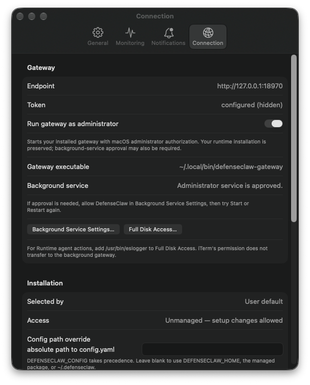
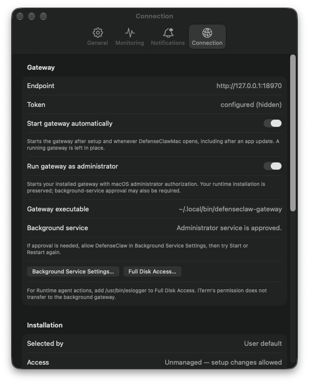

# Automatic gateway startup

DefenseClawMac enables **Start gateway automatically** by default. The preference is shared by the first-run setup screen and Settings → Connection. Turning it off is remembered across app launches and updates.

After successful setup, the app starts the configured gateway and checks its health. Each subsequent app launch checks whether the gateway is running and starts it when it is offline. The app updater relaunches DefenseClawMac, so the same startup check runs after an update. Configuration and an installed gateway are required before startup can proceed.

Automatic startup uses the selected installation and the usual Activity recording. When **Run gateway as administrator** is enabled, the existing macOS authorization flow applies. A required approval or canceled prompt is shown in Activity and setup remains open if its final startup did not finish. Managed and read-only installations keep their existing service-management rules.

There is one automatic attempt per app launch. Reopening the main window or refreshing a panel does not restart a gateway stopped during that session. A failed or canceled attempt can be retried with **Start Gateway** in Overview. Active automatic startup can be canceled in Activity; overlapping Start, Stop, and Restart actions wait until that operation finishes.

The startup check preserves a running gateway. A timeout, authentication failure, or malformed health response produces no duplicate start. Setup initialization is checked using its structured report, because some runtime versions return exit code zero even when their report says setup needs attention. Setup commands defer gateway lifecycle until the final recorded start so administrator mode applies consistently.

App updates continue to preserve the existing runtime. This change does not install, replace, downgrade, or upgrade a runtime, and does not enable macOS Launch at Login. A fresh installation starts its gateway after the user completes configuration in the app.

## Verification

The standalone coordinator tests exercise default-on preferences, explicit opt-out, running/offline/inconclusive health, missing configuration, read-only and busy installations, concurrent triggers, stale installation and command state, canceled and failed startup, and new app launches. Onboarding tests cover structured setup results and deferred connector startup. Administrator/CLI tests cover cancellation before dispatch.

### Compatibility audit — September 22, 2026

The audit checked current upstream `f05a9d3cb115c18f2c7903590a82dadf8835f2ae`
(runtime 0.8.10, configuration schema 8) against this branch's app version 1.1.24.
The selected CLI resolves from `~/.local/bin/defenseclaw` to
`~/.defenseclaw/.venv/bin/defenseclaw`; its gateway is the published 0.8.10 build
at `bf45995c7fa691f34ffa89b6f0468c93a6207dea`.

- All **36 headless suites** and the isolated Debug build passed for the initial
  eight-file production candidate. The 37th discovered script explicitly skips
  native GUI testing by default; it is not counted as a GUI pass.
- Local verification then identified a restored-minimized-window case requiring
  an application-launch callback. The added lifecycle contract test and a final
  Debug build passed after that ninth-file change. The full 36-suite run was not
  repeated after this focused lifecycle addition.
- The final read-only audit confirms **35 reviewed source differences**. Six
  existing entries retain their prior rationale with the new purpose appended;
  three entries are new, and all 26 unrelated entries and reasons are unchanged.
  Registry parity (235 entries), runtime help, the 24-section setup catalog,
  schema, and protected installer contracts passed.

The audit retains one separate dependency difference: installed cryptography
48.0.1 matches the authenticated 0.8.10 release requirement `>=48.0.1,<49`, while
current mainline requires `>=50.0.0,<51`. The final audit therefore exits 1; no
dependency was changed or failure suppressed. The previously reported 76-file
source-checkout difference described an earlier selected installation and is
not evidence about this current release installation.

Evidence is retained under
`/private/tmp/defenseclaw-gateway-autostart-compat.ur4qopzw/`, including the full
audit, final baseline confirmation, reviewed hashes, and source/build timing.
The final lifecycle build log is
`/private/tmp/defenseclawmac-gateway-autostart-final-build.log`. These checks did
not initialize, start, stop, or upgrade the live runtime. This is source and
Debug-build verification, not a new signed release.

### Local UI verification

The final Debug app was launched with an isolated missing-configuration fixture.
First-run setup displayed **Start gateway automatically** on; the accessibility
value was `1`. The fixture is deliberately read-only, so initialization was not
performed. This verifies the first-run default and layout, not a fresh runtime
installation.

The final Debug app was then reopened against the existing selected installation.
Settings → Connection displayed **Start gateway automatically** on and enabled
(accessibility value `1`, enabled `true`). The existing gateway PID remained
unchanged and `/health` returned HTTP 200 before and after launch. Both app output
logs were empty. No gateway lifecycle command or runtime installation was invoked
manually for these checks. The Debug app was closed afterward; the installed app
was left running.

| Before | After |
| --- | --- |
|  |  |

Offline startup, cancellation, administrator routing, setup-report failures,
explicit opt-out, and concurrent actions are covered by the automated tests;
root gateway startup was not repeated in this UI check.
