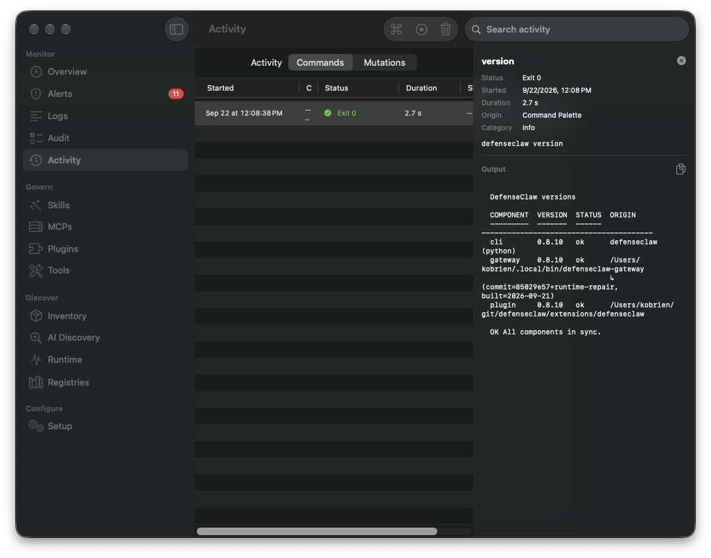

# Inspector crash correction — DefenseClawMac 1.1.24

Opening an alert's inspector in a narrow window could terminate DefenseClawMac on macOS 27. The submitted 1.1.23 recording shows Activity → Logs → Alerts, selection of a scan-finding row, the inspector opening, and the application exiting. The crash is a native window-constraint loop, independent of gateway administrator authorization.

## Reproduction and cause

The published 1.1.23 app reproduced the same crash locally: open Alerts in a wide window, close the inspector, resize to 1180 × 760, then select another alert. AppKit threw `NSGenericException` because the window requested more Update Constraints passes than there were views. The exception stack includes `SplitViewChildController.hostingView(_:didUpdateMinSize:maxSize:)` and `NSHostingView.SizeConstraints.update(from:)`.

The native inspector negotiates space with the main table/header pane. That main pane propagated a content-dependent minimum size while the inspector was being inserted. The fix applies a flexible, zero-minimum frame to the main pane immediately before `.inspector`, allowing it to compress within the available space. The existing inspector width policy (250 / 320 / 380 points), window minimum, data, actions, and user-controlled sidebar remain intact. Alerts, Audit, Logs, and Activity share the modifier. A frame around the inspector content alone did not prevent the reproduced failure.

## Verification

| Check | Before | With correction |
|---|---|---|
| Full app, Alerts at 1180 × 760 | Exact constraint exception; exit 134 | Inspector opens; app remains responsive |
| Full app, repeated Alerts selections | Reproduced at narrow width | Ten selections and five close/reopen cycles across 980, 1180, and 1677-pixel window widths pass |
| Native synthetic regression at 980 | Exact same exception and stack | Eight selections, asynchronous detail hydration, four close cycles, and final window-width checks pass |
| Native synthetic regression at 1180 | — | Same complete sequence passes |
| Full app, Logs and Audit at 980 | — | Selection and inspector presentation pass |
| Full app, Activity at 980 | — | Read-only `defenseclaw version` completes; command inspector opens and remains responsive |

The opt-in native test uses synthetic records and the actual production layout modifier. It neither reads nor changes the installed runtime. An external watchdog fails the test if the native layout blocks the main thread; survival alone is insufficient because completion, hydration counts, and final window size are required.

```bash
./script/test_inspector_native_layout.sh --run-gui --verify-reproducer
```

The optional baseline control requires an affected macOS version to establish the before/after comparison. Without `--run-gui`, the script explicitly skips GUI testing for ordinary headless test runs. Activity's command inspector was exercised live; its mutation inspector was not separately exercised. Narrow tables retain native horizontal scrolling. This correction does not redesign every panel's compact-width headers.



All 35 headless suites and an isolated Debug app build passed. See [release verification](RELEASE_VERIFICATION_1.1.24_2026-09-22.md) for exact source/runtime identities and the intentionally preserved runtime-source mismatch. The installed runtime was not replaced, and the separate Runtime coverage issues documented for 1.1.23 remain outside this layout fix.
