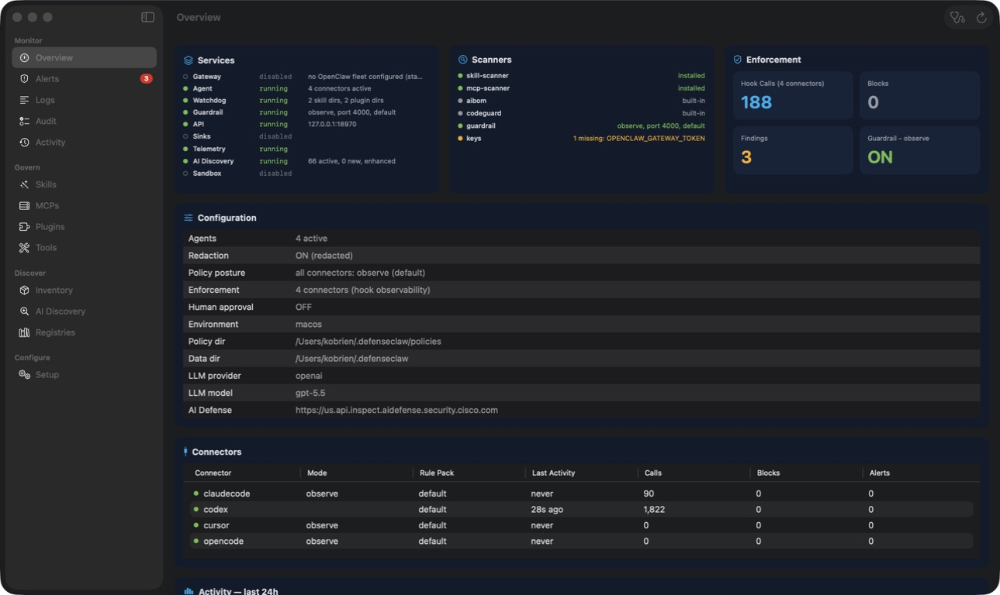
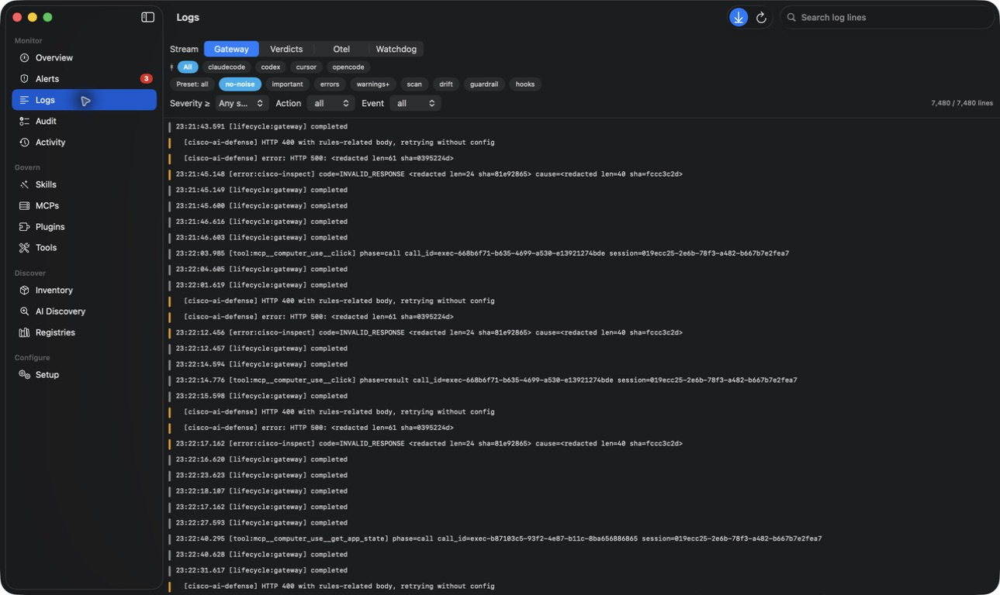
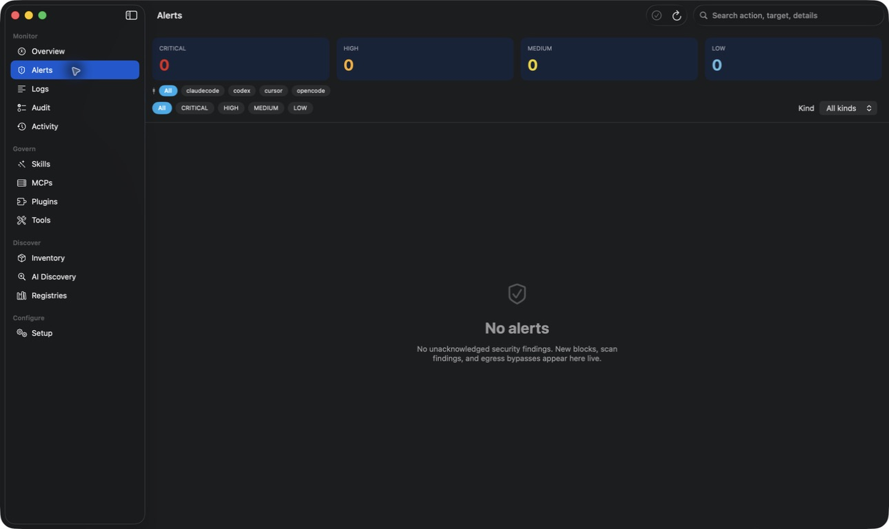

# DefenseClawMac UX and Accessibility Audit

Date: 2026-06-26  
Version reviewed: 0.3.19  
Mode: Combined UX and accessibility review  
Surface: Main window, monitoring workflow, settings, and menu bar companion

## Audit Scope

This audit reviews the current macOS SwiftUI app against native desktop interaction patterns and Apple's Human Interface Guidelines. Evidence comes from the running 0.3.19 release build, its accessibility tree, and the current source implementation.

The primary user goal is to understand DefenseClaw's security posture, investigate findings and logs, and act without losing trust in the meaning or scope of an operation.

## Step 1 - Overview Dashboard

Health: Needs refinement

### Strengths

- The native sidebar provides stable, grouped navigation using familiar SF Symbols.
- Services, scanners, enforcement, configuration, connectors, and activity have a clear operational hierarchy.
- Status colors are generally paired with text, so color is not the only signal.
- Enforcement tiles expose useful accessibility labels and deep-link into detailed views.

### UX Risks

- Configuration dominates most of the first viewport, pushing trend and diagnostic content below the fold.
- Primary operational text is frequently rendered at caption size and is difficult to scan at normal laptop distance.
- Hook Calls, Blocks, and Findings use different data scopes without displaying those scopes or a last-updated time.
- Enforcement tiles look like static statistics. Hover, focus, and navigation affordances are too subtle for clickable controls.
- The app forces Dark Mode, overriding the person's system appearance and contrast preferences.

### Recommendations

1. Keep the top health row, but collapse Configuration to a concise posture summary with a disclosure or detail action.
2. Use body or callout text for primary status values; reserve caption text for metadata.
3. Add metric scope labels such as `Latest 500 events` and `Unacknowledged`, plus a shared last-updated indicator.
4. Add visible hover, keyboard-focus, and chevron treatment to clickable metric tiles.
5. Remove forced Dark Mode and validate light, dark, and Increase Contrast appearances.

## Step 2 - Logs Investigation

Health: Needs improvement

### Strengths

- Stream selection, connector filtering, presets, search, and auto-scroll are visible without opening a modal.
- Auto-scroll is a toolbar toggle and does not pull the user away while reading older entries.
- Severity is represented with both a color mark and textual content.
- The current list supports selection and contextual copy actions.

### UX Risks

- The filter area has three competing selection layers and nine custom preset chips, producing high visual and keyboard-navigation load.
- Log rows are very small and dense, with long call IDs, session IDs, hashes, lengths, and redaction artifacts competing with the event itself.
- Repeated lifecycle and retry entries dominate the screen, making meaningful security events hard to find.
- Custom chip buttons do not expose a selected trait in source, so assistive technology may announce them as unrelated buttons.

### Recommendations

1. Keep Stream as a segmented control, move connector selection to a menu when there are many connectors, and make Preset a single menu.
2. Show a concise primary row such as time, event type, action, and result. Put IDs and raw JSON in a detail inspector.
3. Collapse repeated lifecycle/retry events into a single row with a repetition count.
4. Remove redaction length/hash markers from the default human view while preserving them in raw details.
5. Use a regular monospaced body size for the main event and secondary styling for metadata.

## Step 3 - Alert Triage

Health: Good foundation with a trust gap

### Strengths

- Severity summaries, connector filters, kind selection, search, and acknowledgement are easy to locate.
- The empty state clearly explains what appears in this view.
- Acknowledge is disabled when there is no selection.
- A native Table is used when findings are present.

### UX Risks

- The Overview capture showed three Findings, but the subsequent Alerts capture showed none, with no visible loading or reconciliation explanation. Even if data changed between refreshes, the transition appears contradictory.
- The full Alerts view confirms acknowledgement, but the menu bar's `Ack All` executes immediately.
- Acknowledging one audit row can affect its entire severity class, while the confirmation headline describes only the selected row count.
- `Dismiss (local)` actually means a temporary hide that clears on relaunch.

### Recommendations

1. Drive Overview, menu bar, sidebar badge, and Alerts from one published snapshot and display its timestamp.
2. Keep previous values visible during refresh and show a small updating state instead of briefly presenting contradictory counts.
3. Confirm `Ack All` in the menu bar and state the affected severity classes and record counts.
4. Rename temporary dismissal to `Hide Until Relaunch`.

## Step 4 - Settings

Health: Good native structure; capture blocked

The live accessibility inspection confirmed the General, Monitoring, Notifications, and Connection panes in the standard Settings scene. The Settings window's material layers could not be preserved in the local screenshot returned by the capture pipeline, so the rejected image is not included as evidence.

### Strengths

- Settings uses a dedicated macOS Settings scene with persistent toolbar tabs.
- The active pane updates the window title and the zoom control is disabled.
- Preferences use native toggles, forms, sliders, and labeled values.

### UX Risks

- A fixed `560 x 720` frame leaves large empty regions in shorter panes and can clip with larger text or localization.
- `Show Dock icon` and `Hide to menu bar when minimized` can both be enabled even though minimizing temporarily removes the Dock icon.
- `Upgrade Mac App`, `Upgrade Runtime`, and `Upgrade Both` remain action labels while status says `Up to date`; their first behavior is actually to check for updates.

### Recommendations

1. Let each pane size to its content and use scrolling only when needed.
2. Default standard minimize behavior on, rename the override to `Hide Instead of Minimize`, and explain its dependency on Dock visibility.
3. Use `Check for Updates` until an update is available, then change the action to `Install and Restart` or `Upgrade Runtime`.

## Step 5 - Menu Bar Companion

Health: Source-reviewed; capture blocked

The native menu bar status item could not be targeted by the current Computer Use capture session, so this step is based on source and accessibility inspection rather than a saved screenshot.

### Strengths

- The popover is concise and routes deeper tasks to the main window.
- Connector health, enforcement metrics, recent alerts, pause/resume, and quit are grouped logically.
- Metric rows include explicit accessibility labels.

### UX Risks

- `Ack All` lacks confirmation and differs from the safer full-window flow.
- The three bars use unrelated, unlabeled saturation formulas, so their lengths cannot be compared meaningfully.
- There is no visible Settings entry in the popover, which matters when the app is running without a Dock icon.

### Recommendations

1. Confirm acknowledgement and summarize the exact scope before execution.
2. Replace unlabeled bars with trends, explicit rates, or a clearly named relative-activity scale.
3. Add a Settings entry without expanding the popover into a full dashboard.

## Cross-Cutting Findings

### Structural

1. Use an identified `WindowGroup` for the primary launch window in this menu-bar-plus-window app.
2. Store sidebar selection in `@SceneStorage` and restore it instead of disabling window restoration.
3. Provide menu commands for toolbar actions such as Run Health Check and Scan Now.
4. Respect standard minimize behavior by default.

### Visual and Accessibility

1. Respect system appearance, semantic colors, Increase Contrast, and Reduce Transparency.
2. Replace custom single-select chip groups with native segmented Pickers or menus.
3. Ensure clickable cards expose hover, focus, selected state, and action hints.
4. Increase primary operational text from caption to body/callout sizes.
5. Test keyboard-only navigation, VoiceOver order, larger text, and full keyboard access with Accessibility Inspector.

### Trust and Safety

1. Ensure every count displays its source window and timestamp.
2. Make destructive or broad-scope acknowledgement language match its real effect.
3. Replace the first-run pipe-to-shell command with a signed or verified installer path, or at least expose script review and checksum information.

## Recommended Implementation Order

1. P0: Shared metric snapshot and timestamps; acknowledgement confirmation and truthful scope labels.
2. P1: System appearance support; standard minimize behavior; adaptive Settings sizing.
3. P1: Log progressive disclosure; native filter controls; readable primary typography.
4. P2: WindowGroup and SceneStorage cleanup; command-menu parity; onboarding installation trust.

## Evidence Limits

- Screenshots demonstrate visible hierarchy and current accessibility-tree roles, not full WCAG or VoiceOver compliance.
- Settings was inspected live but its transparent material could not be saved correctly by the screenshot pipeline.
- The menu bar status item was not targetable in the current capture session.
- Light appearance, Increase Contrast, Reduce Transparency, keyboard-only operation, and VoiceOver require dedicated runtime testing after the forced dark appearance is removed.

## Apple References

- [Human Interface Guidelines](https://developer.apple.com/design/human-interface-guidelines)
- [Dark Mode](https://developer.apple.com/design/human-interface-guidelines/dark-mode)
- [Accessibility](https://developer.apple.com/design/human-interface-guidelines/accessibility)
- [Settings](https://developer.apple.com/design/human-interface-guidelines/settings)
- [Sidebars](https://developer.apple.com/design/human-interface-guidelines/sidebars)
- [Toolbars](https://developer.apple.com/design/human-interface-guidelines/toolbars)
- [Segmented controls](https://developer.apple.com/design/human-interface-guidelines/segmented-controls)

## Source Evidence

- [`DefenseClawApp.swift`](../../../DefenseClawMac/App/DefenseClawApp.swift)
- [`MainWindow.swift`](../../../DefenseClawMac/Features/MainWindow.swift)
- [`OverviewView.swift`](../../../DefenseClawMac/Features/OverviewView.swift)
- [`LogsView.swift`](../../../DefenseClawMac/Features/LogsView.swift)
- [`AlertsView.swift`](../../../DefenseClawMac/Features/AlertsView.swift)
- [`MenuBarPopover.swift`](../../../DefenseClawMac/Features/MenuBarPopover.swift)
- [`AppSettingsView.swift`](../../../DefenseClawMac/Features/AppSettingsView.swift)
- [`Components.swift`](../../../DefenseClawMac/DesignSystem/Components.swift)

